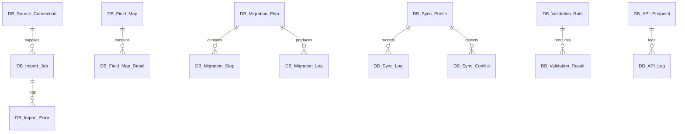

# DataBridge — Architecture

## App Identity

| Property     | Value                |
| ------------ | -------------------- |
| **App Name** | databridge           |
| **Prefix**   | DB                   |
| **Color**    | `#0EA5E9` (Sky Blue) |
| **Version**  | 0.0.1                |
| **License**  | MIT                  |

## Required Apps

```
frappe >= 16.0.0
frappe_visual >= 0.1.0
arkan_help >= 0.0.1
base_base >= 0.0.1
```

## Module Map

| Module         | DocTypes                                                         | Purpose                          |
| -------------- | ---------------------------------------------------------------- | -------------------------------- |
| DB Settings    | DB Settings                                                      | Global app configuration         |
| Import Export  | DB Import Job, DB Import Error, DB Export Job                    | Data import/export operations    |
| Migration      | DB Migration Plan, DB Migration Step, DB Migration Log           | Migration planning and execution |
| Mapping        | DB Field Map, DB Field Map Detail, DB Transform Rule             | Field mapping and transformation |
| Sync           | DB Sync Profile, DB Sync Schedule, DB Sync Log, DB Sync Conflict | Bidirectional synchronization    |
| Data Integrity | DB Validation Rule, DB Validation Result, DB Data Audit          | Data validation and audit        |
| Api Hub        | DB API Endpoint, DB API Key, DB API Log                          | External API management          |
| Connectors     | DB Source Connection, DB Connector Config                        | Data source connectors           |

## Services

| Service           | File                             | Responsibilities                               |
| ----------------- | -------------------------------- | ---------------------------------------------- |
| ImportService     | `services/import_service.py`     | Batch import, progress tracking, error logging |
| MigrationService  | `services/migration_service.py`  | Migration planning, dependency resolution      |
| SyncService       | `services/sync_service.py`       | Bidirectional sync, conflict detection         |
| MappingService    | `services/mapping_service.py`    | Auto-mapping, confidence scoring, validation   |
| ValidationService | `services/validation_service.py` | Data validation, duplicate detection           |
| HistoryService    | `services/history_service.py`    | Import/export history tracking                 |

## API Endpoints (v1)

| Endpoint                                            | Method | File                      |
| --------------------------------------------------- | ------ | ------------------------- |
| `databridge.api.v1.import_export.start_import`      | POST   | `api/v1/import_export.py` |
| `databridge.api.v1.import_export.get_import_status` | GET    | `api/v1/import_export.py` |
| `databridge.api.v1.mapping.get_field_maps`          | GET    | `api/v1/mapping.py`       |
| `databridge.api.v1.mapping.auto_map`                | POST   | `api/v1/mapping.py`       |
| `databridge.api.v1.migration.get_plans`             | GET    | `api/v1/migration.py`     |
| `databridge.api.v1.migration.execute_plan`          | POST   | `api/v1/migration.py`     |

## CAPS Capabilities (14)

| Capability            | Category | Description                    |
| --------------------- | -------- | ------------------------------ |
| DB_manage_settings    | Module   | Configure app settings         |
| DB_import_data        | Action   | Execute data imports           |
| DB_export_data        | Action   | Execute data exports           |
| DB_manage_mappings    | Module   | Create/edit field maps         |
| DB_manage_connections | Module   | Create/edit source connections |
| DB_run_migrations     | Action   | Execute migration plans        |
| DB_manage_sync        | Module   | Configure sync profiles        |
| DB_view_audit         | Report   | View data audit logs           |
| DB_manage_validation  | Module   | Create/edit validation rules   |
| DB_manage_api_hub     | Module   | Configure API endpoints        |
| DB_view_history       | Report   | View import/export history     |
| DB_bulk_operations    | Action   | Run bulk data operations       |
| DB_export_reports     | Report   | Export audit reports           |
| DB_api_access         | Action   | Use API endpoints              |

## ERD (Simplified)


