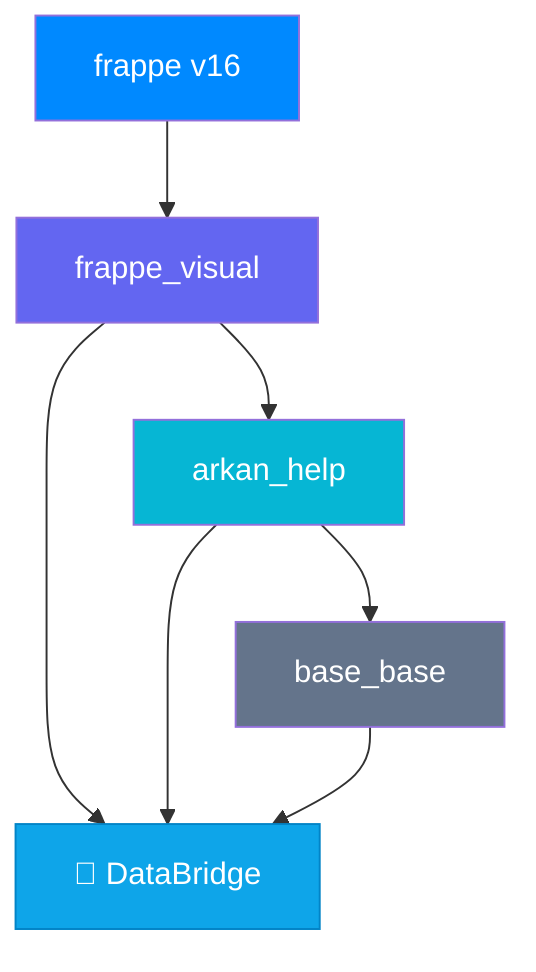

# DataBridge — Dependency Graph
# مخطط التبعيات — DataBridge

```mermaid
graph TD
    frappe["frappe v16"]
    frappe_visual["frappe_visual"]
    arkan_help["arkan_help"]
    base_base["base_base"]
    databridge["🔗 DataBridge"]

    frappe --> frappe_visual
    frappe_visual --> arkan_help
    arkan_help --> base_base
    frappe_visual --> databridge
    arkan_help --> databridge
    base_base --> databridge

    style databridge fill:#0EA5E9,color:#fff,stroke:#0284C7
    style frappe fill:#0089FF,color:#fff
    style frappe_visual fill:#6366F1,color:#fff
    style arkan_help fill:#06B6D4,color:#fff
    style base_base fill:#64748B,color:#fff
```
