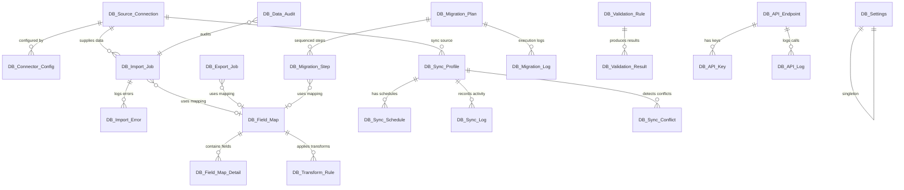

# DataBridge — Entity Relationship Diagram
# مخطط علاقات الكيانات — DataBridge

```mermaid
erDiagram
    DB_Settings ||--|| DB_Settings : singleton

    DB_Source_Connection ||--o{ DB_Connector_Config : "configured by"
    DB_Source_Connection ||--o{ DB_Import_Job : "supplies data"
    DB_Source_Connection ||--o{ DB_Sync_Profile : "sync source"

    DB_Import_Job ||--o{ DB_Import_Error : "logs errors"
    DB_Import_Job }o--o| DB_Field_Map : "uses mapping"

    DB_Export_Job }o--o| DB_Field_Map : "uses mapping"

    DB_Field_Map ||--o{ DB_Field_Map_Detail : "contains fields"
    DB_Field_Map ||--o{ DB_Transform_Rule : "applies transforms"

    DB_Migration_Plan ||--o{ DB_Migration_Step : "sequenced steps"
    DB_Migration_Plan ||--o{ DB_Migration_Log : "execution logs"
    DB_Migration_Step }o--o| DB_Field_Map : "uses mapping"

    DB_Sync_Profile ||--o{ DB_Sync_Schedule : "has schedules"
    DB_Sync_Profile ||--o{ DB_Sync_Log : "records activity"
    DB_Sync_Profile ||--o{ DB_Sync_Conflict : "detects conflicts"

    DB_Validation_Rule ||--o{ DB_Validation_Result : "produces results"
    DB_Data_Audit }o--|| DB_Import_Job : "audits"

    DB_API_Endpoint ||--o{ DB_API_Key : "has keys"
    DB_API_Endpoint ||--o{ DB_API_Log : "logs calls"
```
