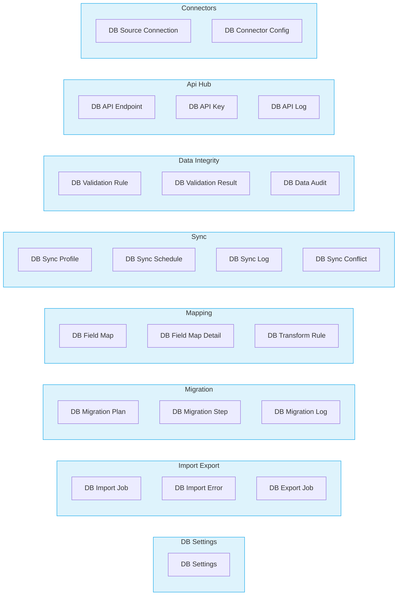

# DataBridge — Module Map
# خريطة الوحدات — DataBridge

```mermaid
graph LR
    subgraph DB_Settings["DB Settings"]
        s1["DB Settings"]
    end
    subgraph Import_Export["Import Export"]
        ie1["DB Import Job"]
        ie2["DB Import Error"]
        ie3["DB Export Job"]
    end
    subgraph Migration
        m1["DB Migration Plan"]
        m2["DB Migration Step"]
        m3["DB Migration Log"]
    end
    subgraph Mapping
        mp1["DB Field Map"]
        mp2["DB Field Map Detail"]
        mp3["DB Transform Rule"]
    end
    subgraph Sync
        sy1["DB Sync Profile"]
        sy2["DB Sync Schedule"]
        sy3["DB Sync Log"]
        sy4["DB Sync Conflict"]
    end
    subgraph Data_Integrity["Data Integrity"]
        di1["DB Validation Rule"]
        di2["DB Validation Result"]
        di3["DB Data Audit"]
    end
    subgraph Api_Hub["Api Hub"]
        ah1["DB API Endpoint"]
        ah2["DB API Key"]
        ah3["DB API Log"]
    end
    subgraph Connectors
        co1["DB Source Connection"]
        co2["DB Connector Config"]
    end

    style DB_Settings fill:#0EA5E922,stroke:#0EA5E9
    style Import_Export fill:#0EA5E922,stroke:#0EA5E9
    style Migration fill:#0EA5E922,stroke:#0EA5E9
    style Mapping fill:#0EA5E922,stroke:#0EA5E9
    style Sync fill:#0EA5E922,stroke:#0EA5E9
    style Data_Integrity fill:#0EA5E922,stroke:#0EA5E9
    style Api_Hub fill:#0EA5E922,stroke:#0EA5E9
    style Connectors fill:#0EA5E922,stroke:#0EA5E9
```
